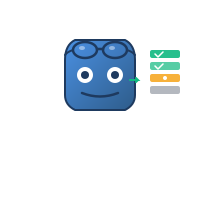
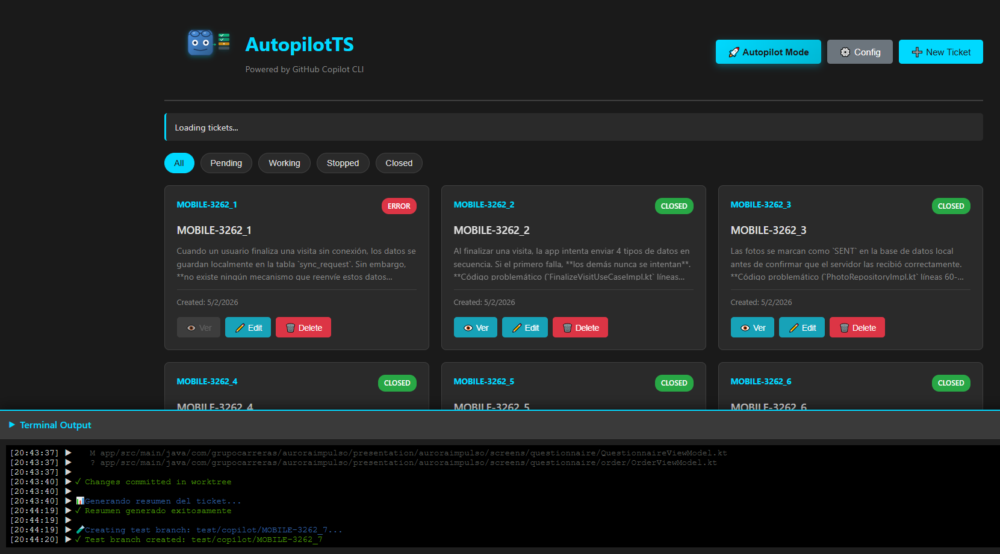
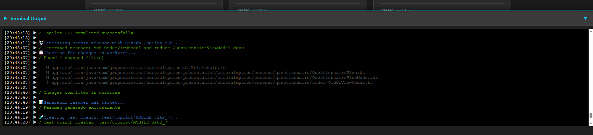
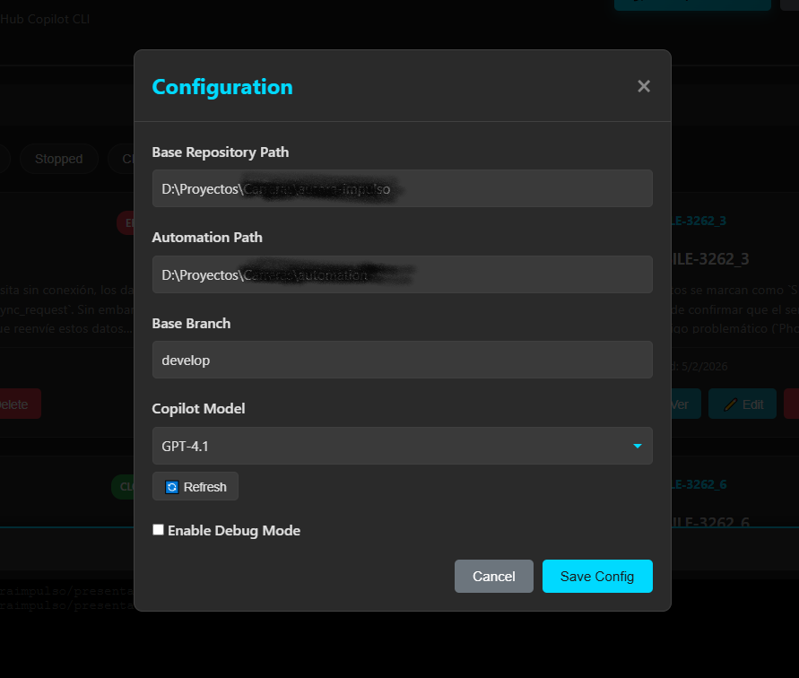

<div align="center">



# AutopilotTS

**Let GitHub Copilot resolve tickets while you do other things**

[](https://www.typescriptlang.org/)
[](https://nodejs.org/)
[](https://github.com/features/copilot)
[](https://opensource.org/licenses/MIT)

</div>

---

## Disclaimer

**This is a hobby/personal project, basically a proof of concept.** I made it to experiment with GitHub Copilot CLI and SDK. Use it at your own risk. There are no guarantees it will work perfectly (or work at all). The code may have bugs, design decisions may be questionable, and documentation may be incomplete.

**TL;DR:** It's an experiment. Have fun, but don't use it in production without reviewing it thoroughly.

---

## Table of Contents

- [What is this?](#what-is-this)
- [Main objective](#main-objective)
- [How it works](#how-it-works)
- [Installation](#installation)
- [Quick start](#quick-start)
- [Commands](#commands)
- [Configuration](#configuration)
- [Development](#development)
- [License](#license)

---

## What is this?

AutopilotTS was born as a **CLI tool** that uses **GitHub Copilot CLI** and **GitHub Copilot SDK** to automatically resolve development tickets while you focus on other things.

**However**, for a better user experience, a **Web UI version** was developed where most recent improvements have been concentrated. The terminal CLI version still works, but it's more neglected.

<div align="center">
  
  <p><i>Main dashboard view with tickets</i></p>
</div>

The idea came from: *"What if I could give Copilot a list of tasks and have it resolve them while I keep coding more important things?"*

### Key technologies:

- **GitHub Copilot CLI** (`gh copilot`): Main engine that automatically resolves tickets
- **GitHub Copilot SDK** (`@github/copilot-sdk`): For other activities:
  - Generate commit messages based on applied changes
  - Get list of available models
  - Code analysis and documentation
- **Git Worktrees**: Total isolation - each ticket is resolved in its own branch
- **Web UI**: Express + WebSocket for modern interface and real-time logs
- TypeScript, Commander.js (for legacy CLI)

---

## Main objective

**The ideal workflow is this:**

1. **You create a list of tickets** with tasks you want AI to try to resolve
2. **AutopilotTS starts resolving them** one by one, using **GitHub Copilot CLI** for resolution
3. **While AI works, you keep coding** other things on your main branch
4. **When it finishes, you review branch by branch** what AI did
5. **Fix what's wrong, leverage what's right**
6. **Result:** Minimize time wasted waiting for AI, maximize your productivity

<div align="center">
  
  <p><i>Integrated terminal view in Web UI showing resolution process</i></p>
</div>

### The philosophy behind it

AI isn't perfect. It makes mistakes. But it can also do 60-80% of tedious work (refactorings, repetitive changes, basic implementations, etc.).

Instead of sitting around waiting for Copilot to generate code line by line, it's better to:
- Give it a list of tasks
- Go do other things
- Come back and review what it did
- Fix, improve, and done

**It's like having a junior dev making PRs for you to review.** Sometimes they're perfect, sometimes they need changes, but they always save time.

---

## How it works

### The workflow

```
1. Create tickets with tasks/bugs/features
       ↓
2. AutopilotTS creates an isolated git worktree for each ticket
       ↓
3. Calls GitHub Copilot CLI to resolve the ticket
       ↓
4. AI generates code, modifies files, etc.
       ↓
5. AutopilotTS auto-commits with message generated by Copilot SDK
       ↓
6. Generates HTML summary with all changes
       ↓
7. YOU review the branch, test, fix if needed
       ↓
8. Merge or discard based on results
```

### Main components

- **GitHub Copilot CLI** (`gh copilot`): Does the heavy lifting of **resolving tickets**
- **GitHub Copilot SDK** (`@github/copilot-sdk`): For auxiliary tasks:
  - Automatically generate commit messages based on changes
  - Get list of available AI models
  - Code analysis and documentation
- **Git Worktrees**: Each ticket resolves in an isolated worktree (separate branch)
- **Storage**: Saves tickets in `~/.autopilot/tickets.json`
- **Web UI** (main): Modern interface to manage tickets and see real-time logs
- **CLI** (legacy): Terminal interface (more neglected, but functional)

### Why worktrees?

Because you can have multiple tickets being resolved in parallel without interfering with each other, and without affecting your current working branch. Each one in its own bubble.

---

## What it does

- Create, list, view, delete, update tickets
- **GitHub Copilot CLI** for automatic ticket resolution
- **GitHub Copilot SDK** for:
  - Automatic commit message generation
  - Dynamic listing of available AI models
  - Code and change analysis
- Git worktrees for total isolation (safe concurrency)
- Detailed HTML summaries with diffs of all changes
- **Modern Web UI** with:
  - Ticket dashboard
  - Real-time logs (WebSocket)
  - Integrated terminal
  - Visual configuration
- Terminal CLI (legacy, functional but less developed)
- Per-project configuration
- Debug mode to see internal process

---

## Architecture (simplified)

```
         ┌─────────────────────┐
         │   CLI / Web UI      │
         └──────────┬──────────┘
                    │
         ┌──────────▼──────────┐
         │ TicketResolverCLI   │  ← Orchestrates everything
         └─┬────────┬────────┬─┘
           │        │        │
    ┌──────▼──┐ ┌──▼────┐ ┌─▼──────┐
    │ GitHub  │ │ Git   │ │Storage │
    │ Copilot │ │ Mgr   │ │  JSON  │
    │ CLI/SDK │ │Worktree│ │        │
    └─────────┘ └───────┘ └────────┘
```

**TicketResolverCLI** is the main component:
1. Reads the ticket
2. Creates a worktree/branch
3. Calls GitHub Copilot CLI with ticket context
4. Lets AI work
5. Commits the changes
6. Generates HTML summary
7. Ready for you to review

---

## Installation

### Prerequisites

The only requirements are:

1. **GitHub Copilot subscription** (paid or trial)
2. **GitHub Copilot CLI** installed in your terminal
   
   **Important:** We're referring to the [GitHub Copilot CLI](https://github.com/github/copilot-cli) (`@github/copilot` npm package), not the older `gh copilot` extension.
   
   ```bash
   npm install -g @github/copilot
   ```

That's it. The project will handle the rest.

### Install from source

```bash
# Clone the repo
git clone https://github.com/yourusername/autopilotTS.git
cd autopilotTS

# Install dependencies
npm install

# Build
npm run build

# (Optional) Global link to use 'autopilot' from anywhere
npm link
```

---

## Quick start

### 1. Configure your project

**Recommended: Use Web UI**

```bash
# Start Web UI
autopilot ui 3000

# Open http://localhost:3000 in your browser
# Go to configuration section
```

<div align="center">
  
  <p><i>Configuration window in Web UI</i></p>
</div>

**Or from CLI:**

```bash
# Path to your main repo
autopilot config set baseRepositoryPath /path/to/your/project

# Folder where worktrees will be created
autopilot config set autopilotFolderPath /path/automation/folder

# (Optional) Copilot model to use
autopilot config set copilotModel gpt-4o

# (Optional) Enable debug mode
autopilot config debug on
```

### 2. Create tickets

**From Web UI (recommended):**
- Open http://localhost:3000
- Click "New Ticket"
- Write description and save

**From CLI:**
```bash
# Create a ticket with description
autopilot create "Refactor authentication module to use JWT"

# Or in interactive mode
autopilot
> create
```

### 3. Let Copilot resolve them

**From Web UI:**
- Click "Start" on the ticket you want to resolve
- Watch real-time logs in the integrated terminal
- **GitHub Copilot CLI** will get to work...

**From CLI:**
```bash
# Start ticket resolution
autopilot start TICKET-001

# GitHub Copilot CLI will get to work...
# Meanwhile, you can keep coding on your main branch
```

### 4. Review changes

Once it finishes, AutopilotTS will have left you:
- A new branch with changes (in the worktree)
- Automatic commits with messages generated by **GitHub Copilot SDK**
- An HTML summary with all changes (diffs included)

**Now it's your turn:**
```bash
# Go to the worktree folder
cd /path/automation/folder/TICKET-001

# Review the code
git log
git diff develop

# Test that it works
npm test

# If it's good, merge
git checkout develop
git merge test/TICKET-001

# If it's bad, fix or discard
git reset --hard
```

**The key:** 
- **GitHub Copilot CLI** does the heavy lifting of resolving the ticket
- **GitHub Copilot SDK** generates the commit message describing changes
- You review and polish
- Save time, but keep control

---

## Commands

### Web UI (Recommended)

The most comfortable way to use AutopilotTS:

```bash
autopilot ui 3000
# Open http://localhost:3000
```

**Web UI features:**
- Visual dashboard with all tickets
- Integrated terminal with real-time logs (WebSocket)
- Visual configuration (paths, AI model, debug mode)
- Complete ticket management without commands
- REST API for integrations

### CLI Commands (Legacy)

Terminal CLI still works, though it's less developed:

```bash
# Ticket management
autopilot create <description>           # Create ticket
autopilot list                           # List all tickets
autopilot view <ticketId>                # View ticket details
autopilot start <ticketId>               # Start resolution
autopilot stop <ticketId>                # Stop resolution
autopilot delete <ticketId>              # Delete ticket

# Configuration
autopilot config list                    # View current configuration
autopilot config set <key> <value>       # Change configuration
autopilot config debug on/off            # Enable/disable verbose logs

# Interactive mode
autopilot                                # Interactive shell (REPL)
```

**Note:** Most recent improvements were applied to Web UI. If you find bugs in CLI, consider using the web interface.

---

## Configuration

Configuration is stored in `~/.autopilot/.autopilot.config.json`.

### Main options

| Key | What it is | Default |
|-----|------------|---------|
| `baseRepositoryPath` | Path to your main repo | `null` |
| `autopilotFolderPath` | Where to create worktrees | `null` |
| `copilotModel` | AI model to use | `gpt-4o` |
| `debug` | Verbose logs | `false` |
| `baseBranch` | Base branch for creating branches | `main` |

### Available models

AutopilotTS uses **GitHub Copilot SDK** to dynamically get the list of available models based on your account:
- `gpt-4o` - Recommended (balance speed/quality)
- `gpt-5` - If you have access (more advanced)
- `claude-sonnet-4` - Claude Sonnet 4 (excellent for analysis)
- `gpt-4` - Classic GPT-4 (reliable)
- `gpt-3.5-turbo` - Fast but less accurate

**Note:** The model list is automatically obtained from GitHub Copilot, so you'll only see the ones available in your account.

### Example configuration

```json
{
  "baseRepositoryPath": "/home/user/my-project",
  "autopilotFolderPath": "/home/user/autopilot-workspace",
  "copilotModel": "gpt-4o",
  "debug": false,
  "baseBranch": "develop"
}
```

---

## Usage examples

### Example 1: Typical workflow (Web UI)

```bash
# Start Web UI
$ autopilot ui 3000
✓ Web UI running at http://localhost:3000

# From browser:
# 1. Create several tickets from dashboard
# 2. Click "Start" on first ticket
# 3. Watch in real-time how GitHub Copilot CLI resolves it
# 4. Meanwhile, keep coding in your editor

# When it finishes:
# 1. Go to worktree in your terminal
$ cd /autopilot-workspace/TICKET-001
$ git log  # See commit generated by Copilot SDK
$ git diff develop
$ npm test
# 2. If it's good, merge. If not, fix or discard.
```

### Example 1b: CLI workflow (legacy)

```bash
# Create several tickets
$ autopilot create "Add email validation in registration form"
✓ TICKET-001 created

$ autopilot create "Refactor calculateTotal() function for better performance"
✓ TICKET-002 created

# Start resolution of the first one
$ autopilot start TICKET-001
→ Creating worktree...
→ Calling GitHub Copilot CLI...
→ [GitHub Copilot CLI is working...]
→ Generating commit with GitHub Copilot SDK...
✓ Done! Review at: /autopilot-workspace/TICKET-001
```

### Example 2: Debug mode

Useful when something doesn't work as expected:

```bash
$ autopilot config debug on
$ autopilot start TICKET-002
[DEBUG] Creating worktree at: /path/workspace
[DEBUG] Git command: git worktree add ...
[DEBUG] Calling GitHub Copilot CLI...
[DEBUG] Prompt sent: "Refactor calculateTotal() function..."
[DEBUG] AI response: [...]
[DEBUG] Writing file: src/utils/calculator.ts
[DEBUG] Commit: "refactor: optimize calculateTotal function"
✓ Complete!
```

### Example 3: Dynamic model selection

```bash
# Web UI automatically shows models available in your account
# (Thanks to GitHub Copilot SDK)

# From configuration, select the model:
# - gpt-4o (default)
# - claude-sonnet-4 (if you have it)
# - gpt-5 (if you have access)

# Or from CLI:
$ autopilot config set copilotModel claude-sonnet-4
✓ Model updated

# Next ticket will use that model to resolve
```

---

## Development

If you want to modify or extend the project:

```bash
# Clone repo
git clone https://github.com/yourusername/autopilotTS.git
cd autopilotTS

# Install deps
npm install

# Development (without compiling)
npm run dev

# Or build and run
npm run build
npm start
```

### Available scripts

```bash
npm run dev          # Run with tsx (hot reload)
npm run build        # Compile TypeScript to dist/
npm run watch        # Watch mode (recompiles on save)
npm start            # Run compiled version
npm test             # Unit tests (Vitest)
npm run test:watch   # Tests in watch mode
```

### Project structure

```
src/
├── index.ts                  # CLI entry point
├── agents/                   # TicketResolverCLI (orchestrator)
├── commands/                 # CLI command handlers
├── utils/                    # Utilities
│   ├── copilot.ts           # GitHub Copilot SDK
│   ├── copilot-cli.ts       # GitHub Copilot CLI wrapper
│   ├── git.ts               # Git operations
│   ├── storage.ts           # Ticket persistence
│   └── config.ts            # Config management
├── web/                      # Web UI + REST API
└── tests/                    # Unit tests
```

---

## Tests

There are unit tests with Vitest:

```bash
npm test                # Run all tests
npm run test:watch      # Watch mode
```

Coverage: storage, config, prompts, types, workflows.

---

## FAQ / Common issues

### "AI doesn't do what I want"
- Be more specific in ticket description
- Enable debug mode to see what prompt is being sent
- Consider using another AI model
- Remember: AI is good, but not perfect

### "Worktrees get stuck"
- `autopilot stop <ticketId>` should clean up
- If not, delete manually: `git worktree remove /path/worktree`

### "Can I resolve multiple tickets in parallel?"
- Technically yes (each in its worktree)
- In practice, depends on your hardware and how long Copilot CLI takes
- I recommend going one by one to avoid saturation

### "Does this replace a programmer?"
- No. Read the disclaimer above.
- It's a tool to save time on repetitive tasks
- YOU are still the one who reviews, fixes, and decides

### "Why use Web UI instead of CLI?"
- Web UI is more developed and receives more updates
- Integrated terminal with live logs
- More intuitive visual configuration
- Dashboard with status of all tickets
- Terminal CLI works, but is more neglected

---

## License

MIT - Do whatever you want with the code. No warranties.

---

## Credits

- **GitHub Copilot CLI & SDK** - The engine behind all this
- **Commander.js** - CLI parsing
- **Inquirer.js** - Interactive prompts
- **Simple-Git** - Git operations
- **Express & WS** - Web UI

---

## Final notes

This project was born as a personal experiment to see how well I could automate development tasks with GitHub Copilot. It's not perfect, has bugs, and there are probably better ways to do this.

But it works well enough to save me time in my day-to-day. If it helps you, great. If not, that's fine too.

**Ideas? Improvements? Bugs?** Open an issue or PR. Or don't. Your choice.

---

**TL;DR:** CLI tool that uses GitHub Copilot to resolve tickets while you do other things. Always review what AI does. Profit.

---

[Back to top](#autopilotts)
