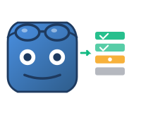
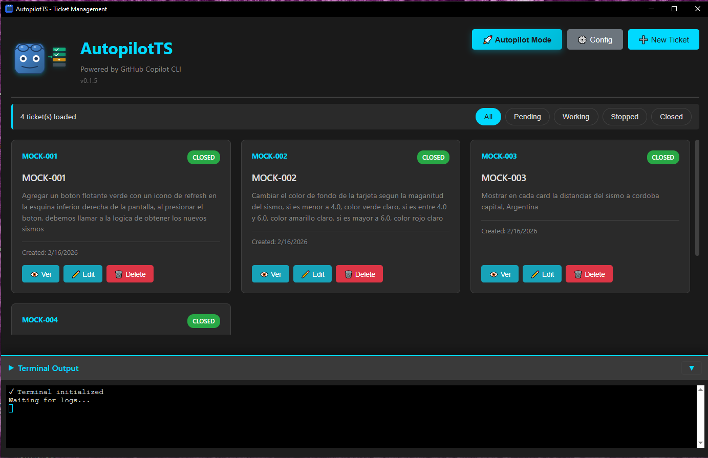
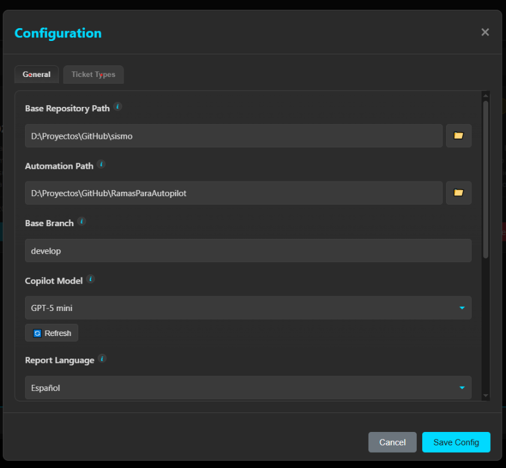

<div align="center">



# AutopilotTS

**Let GitHub Copilot resolve tickets while you do other things**

[](https://www.typescriptlang.org/)
[](https://nodejs.org/)
[](https://github.com/features/copilot)
[](https://opensource.org/licenses/MIT)

</div>

---

## Disclaimer

**This is a hobby/personal project, basically a proof of concept.** I made it to experiment with GitHub Copilot CLI and SDK. Use it at your own risk. There are no guarantees it will work perfectly (or work at all). The code may have bugs, design decisions may be questionable, and documentation may be incomplete.

**TL;DR:** It's an experiment. Have fun, but don't use it in production without reviewing it thoroughly.

---

## Table of Contents

- [What is this?](#what-is-this)
- [Main objective](#main-objective)
- [How it works](#how-it-works)
- [Installation](#installation)
- [Quick start](#quick-start)
- [Commands](#commands)
- [Configuration](#configuration)
- [Development](#development)
- [License](#license)

---

## What is this?

AutopilotTS is a **cross-platform desktop application** built with Electron that uses **GitHub Copilot CLI** to automatically resolve development tickets while you focus on other things.

<div align="center">
  
  <p><i>Main dashboard view with tickets</i></p>
</div>

The idea came from: *"What if I could give Copilot a list of tasks and have it resolve them while I keep coding more important things?"*

### Key technologies:

- **Electron**: Cross-platform desktop application framework (Windows, macOS, Linux)
- **GitHub Copilot CLI** (`copilot -p`): Main engine that automatically resolves tickets
- **GitHub Copilot SDK** (`@github/copilot-sdk`): Auxiliary tasks (commit messages, summaries)
- **Git Worktrees**: Total isolation - each ticket is resolved in its own branch
- **TypeScript**: Type-safe development
- **IPC Architecture**: Secure communication between main process and renderer

---

## Main objective

**The ideal workflow is this:**

1. **You create a list of tickets** with tasks you want AI to try to resolve
2. **AutopilotTS starts resolving them** one by one, using **GitHub Copilot CLI** for resolution
3. **While AI works, you keep coding** other things on your main branch
4. **When it finishes, you review branch by branch** what AI did
5. **Fix what's wrong, leverage what's right**
6. **Result:** Minimize time wasted waiting for AI, maximize your productivity


### The philosophy behind it

AI isn't perfect. It makes mistakes. But it can also do 60-80% of tedious work (refactorings, repetitive changes, basic implementations, etc.).

Instead of sitting around waiting for Copilot to generate code line by line, it's better to:
- Give it a list of tasks
- Go do other things
- Come back and review what it did
- Fix, improve, and done

**It's like having a junior dev making PRs for you to review.** Sometimes they're perfect, sometimes they need changes, but they always save time.

---

## How it works

### The workflow

**New in this version:** AutopilotTS now supports managing **multiple projects**. When the desktop app starts you will be prompted to select an existing project or create a new one. All data (tickets, prompts, config) is stored in a separate subfolder for each project inside the `~/.autopilot` directory; project names are encoded to avoid filesystem issues.


```
1. Create tickets with tasks/bugs/features in the Desktop App
       ↓
2. AutopilotTS creates an isolated git worktree for each ticket
       ↓
3. Calls GitHub Copilot CLI (copilot -p) to resolve the ticket
       ↓
4. AI analyzes code, generates changes, modifies files automatically
       ↓
5. GitHub Copilot SDK generates intelligent commit messages
       ↓
6. AutopilotTS commits changes and generates HTML summary
       ↓
7. YOU review the branch in your IDE, test, fix if needed
       ↓
8. Merge or discard based on results
```

### Main components

- **Electron Desktop App**: Cross-platform native application with modern UI
- **GitHub Copilot CLI** (`copilot -p`): Does the heavy lifting of **resolving tickets**
  - Analyzes codebase context
  - Generates and applies code changes
  - Edits files automatically
- **GitHub Copilot SDK** (`@github/copilot-sdk`): Auxiliary tasks
  - Automatically generate commit messages based on changes
  - Generate HTML summaries with diffs
  - Dynamic listing of available AI models
- **Git Worktrees**: Each ticket resolves in an isolated worktree (separate branch)
- **Storage**: Saves tickets in `~/.autopilot/tickets.json`
- **IPC Communication**: Secure bridge between UI and core logic

### Why worktrees?

Because you can have multiple tickets being resolved in parallel without interfering with each other, and without affecting your current working branch. Each one in its own bubble.

---

## What it does

- **Desktop Application** with native window experience (Windows, macOS, Linux)
- Create, view, update, delete, and manage tickets visually
- **GitHub Copilot CLI** (`copilot -p`) for automatic ticket resolution:
  - AI-powered code generation and modification
  - Automatic file editing based on ticket description
  - Context-aware code changes
- **GitHub Copilot SDK** for auxiliary features:
  - Automatic commit message generation
  - HTML summaries with diffs
  - Dynamic listing of available AI models
- Git worktrees for total isolation (safe concurrency)
- Real-time logs and output in integrated terminal
- Visual configuration panel
- **Multiple project support** (each project maintains its own tickets, prompts and config stored under `~/.autopilot/<project>`)
- Debug mode to see internal process

---

## Architecture (simplified)

```
    ┌─────────────────────────────────┐
    │    Electron Main Process        │
    │  (Node.js + System Access)      │
    └──────────┬──────────────────────┘
               │ IPC
    ┌──────────▼──────────────────────┐
    │   Electron Renderer Process     │
    │   (UI + React-like Interface)   │
    └──────────┬──────────────────────┘
               │
    ┌──────────▼──────────┐
    │  TicketResolverCLI  │  ← Orchestrates everything
    └─┬────────┬────────┬─┘
      │        │        │
┌─────▼────┐ ┌▼────┐ ┌─▼──────┐
│ Copilot  │ │ Git │ │Storage │
│ CLI + SDK│ │ Mgr │ │  JSON  │
└──────────┘ └─────┘ └────────┘
```

**TicketResolverCLI** is the main orchestrator:
1. Receives ticket from Electron UI via IPC
2. Creates a worktree/branch via Git Manager
3. Calls **GitHub Copilot CLI** (`copilot -p`) with ticket context
4. Copilot CLI analyzes codebase and applies code changes automatically
5. Uses **GitHub Copilot SDK** to generate intelligent commit message
6. Commits changes and generates HTML summary (SDK)
7. Returns results to UI for review

---

## Installation

### Prerequisites

The requirements are:

1. **GitHub Copilot subscription** (paid or trial)
2. **GitHub Copilot CLI** installed globally
   
   ```bash
   npm install -g @github/copilot
   ```
   
   This provides the `copilot -p` command that AutopilotTS uses to resolve tickets.

**Note:** The GitHub Copilot SDK (`@github/copilot-sdk`) is already included in the project dependencies for auxiliary features.

### Install from source

```bash
# Clone the repo
git clone https://github.com/yourusername/autopilotTS.git
cd autopilotTS

# Install dependencies
npm install

# Build
npm run build

# (Optional) Global link to use 'autopilot' from anywhere
npm link
```

---

## Quick start

### 1. Launch the Application

```bash
# Start the desktop application
npm start

# Or in development mode
npm run dev
```

The application window will open automatically with the ticket dashboard.

### 2. Configure your project

1. Click the **⚙️ Config** button in the top-right corner
2. Configure the following settings:
   - **Base Repository Path**: Path to your main project repository
   - **Automation Path**: Folder where worktrees will be created
   - **Base Branch**: Default branch (e.g., `develop` or `main`)
   - **Copilot Model**: Select your preferred AI model
   - **Debug Mode**: Enable for verbose logging

<div align="center">
  
  <p><i>Configuration window in Desktop App</i></p>
</div>

### 3. Create tickets

1. Click **➕ New Ticket** button
2. Enter ticket name and description
3. Click **Create Ticket**

Your tickets will appear in the main dashboard.

### 4. Let Copilot resolve them

1. Click the **Start** button on a ticket
2. Watch real-time logs in the integrated terminal
3. **GitHub Copilot CLI** will analyze and resolve the ticket
4. Meanwhile, you can keep coding on your main branch

### 5. Review changes

Once it finishes, AutopilotTS will have left you:
- A new branch with changes (in the worktree)
- Automatic commits with messages generated by **GitHub Copilot SDK**
- An HTML summary with all changes (diffs included)

**Now it's your turn:**
```bash
# Go to the worktree folder
cd /path/automation/folder/TICKET-001

# Review the code
git log
git diff develop

# Test that it works
npm test

# If it's good, merge
git checkout develop
git merge test/TICKET-001

# If it's bad, fix or discard
git reset --hard
```

**The key:** 
- **GitHub Copilot CLI** (`copilot -p`) does the heavy lifting of analyzing and resolving the ticket
- **GitHub Copilot SDK** generates intelligent commit messages and summaries
- You review and polish the results
- Save time, but keep control

---

## Desktop Application Interface

The desktop application provides a user-friendly graphical interface to manage all ticket operations:

**Main Features:**
- 📊 **Dashboard**: View all tickets with their current status
- ➕ **New Ticket**: Create tickets with detailed descriptions
- ▶️ **Start/Stop**: Control ticket resolution
- ⚙️ **Configuration**: Manage all settings visually
- 📺 **Terminal**: Real-time logs and output
- 🗑️ **Delete**: Remove completed or unwanted tickets

### Build Commands

```bash
# Development
npm run dev              # Run with hot reload
npm run watch            # Watch mode for TypeScript

# Build
npm run build            # Compile TypeScript

# Production
npm start                # Run the desktop app

# Distribution
npm run pack             # Package app (no installer)
npm run dist             # Create distributable installers
```

---

## Configuration

Each project maintains its own configuration file located at `~/.autopilot/<project>/config.json` (where `<project>` is a base64-encoded folder name). When the desktop app launches it will prompt you to select a project; the active project determines which config is read and written. You can also override the entire autopilot root directory by setting the `AUTOPILOT_DIR` environment variable.

### Main options

| Key | What it is | Default |
|-----|------------|---------|
| `baseRepositoryPath` | Path to your main repo | `undefined` |
| `automationPath` | Where to create worktrees (ticket worktrees) | `undefined` |
| `copilotModel` | AI model to use | `gpt-4o` |
| `debug` | Verbose logs | `false` |
| `baseBranch` | Base branch for creating branches | `develop` |

(The rest of the table remains the same.)

### Available models

AutopilotTS uses **GitHub Copilot SDK** to dynamically get the list of available models based on your account:
- `gpt-4o` - Recommended (balance speed/quality)
- `gpt-5` - If you have access (more advanced)
- `claude-sonnet-4` - Claude Sonnet 4 (excellent for analysis)
- `gpt-4` - Classic GPT-4 (reliable)
- `gpt-3.5-turbo` - Fast but less accurate

**Note:** The model list is automatically obtained from GitHub Copilot, so you'll only see the ones available in your account.

### Example configuration

```json
{
  "baseRepositoryPath": "/home/user/my-project",
  "autopilotFolderPath": "/home/user/autopilot-workspace",
  "copilotModel": "gpt-4o",
  "debug": false,
  "baseBranch": "develop"
}
```

---

## Usage examples

### Example 1: Typical workflow

```bash
# Launch the desktop application
$ npm start

# In the application window:
# 1. Create several tickets from dashboard
# 2. Click "Start" on first ticket
# 3. Watch in real-time how GitHub Copilot CLI resolves it
# 4. Meanwhile, keep coding in your editor

# When it finishes:
# 1. Go to worktree in your terminal
$ cd /autopilot-workspace/TICKET-001
$ git log  # See commit with message generated by SDK
$ git diff develop
$ npm test
# 2. If it's good, merge. If not, fix or discard.
```

### Example 2: Debug mode

Useful when something doesn't work as expected:

1. Open the desktop app
2. Click **⚙️ Config**
3. Enable **Debug Mode** checkbox
4. Click **Save Config**
5. Start a ticket and watch verbose logs in the terminal

The integrated terminal will show detailed information:
```
[DEBUG] Creating worktree at: /path/workspace
[DEBUG] Git command: git worktree add ...
[DEBUG] Calling GitHub Copilot CLI (copilot -p)...
[DEBUG] Prompt: "Refactor calculateTotal() function..."
[DEBUG] Copilot CLI analyzing codebase...
[DEBUG] Changes applied to: src/utils/calculator.ts
[DEBUG] Generating commit message with SDK...
[DEBUG] Commit: "[feat]: refactor: optimize calculateTotal function(TICKET-001)"
✓ Complete!
```

### Example 3: Dynamic model selection

The desktop app automatically shows models available in your account (thanks to GitHub Copilot SDK):

1. Open **⚙️ Config**
2. Click **🔄 Refresh** next to the model dropdown
3. Select your preferred model:
   - `gpt-4o` (default)
   - `claude-sonnet-4` (if you have it)
   - `gpt-5` (if you have access)
4. Click **Save Config**

The next ticket will use your selected model.

---

## Development

If you want to modify or extend the project:

```bash
# Clone repo
git clone https://github.com/yourusername/autopilotTS.git
cd autopilotTS

# Install deps
npm install

# Development (without compiling)
npm run dev

# Or build and run
npm run build
npm start
```

### Available scripts

**Development:**
```bash
npm run dev          # Run with tsx (hot reload)
npm run build        # Compile TypeScript to dist/
npm run watch        # Watch mode (recompiles on save)
npm start            # Run compiled version
```

**Testing:**
```bash
npm test             # Unit tests (Vitest)
npm run test:watch   # Tests in watch mode

# Or use .bat scripts (Windows)
test.bat             # Run all tests
test-watch.bat       # Watch mode
test-coverage.bat    # Coverage report
```

**Production build (Windows):**
```bash
# Using .bat scripts (recommended for Windows users)
build-production.bat # Full production build (clean + build + package)
build-quick.bat      # Quick rebuild (no clean, faster)

# Or using npm directly
npm run dist         # Build for current platform
npm run dist -- --win --x64  # Build for Windows 64-bit
npm run pack         # Build without installer (unpacked only)
```

**Output:**
- Installer: `release/AutopilotTS Setup [version].exe` (NSIS installer)
- Portable: `release/win-unpacked/` (no installation required)

### Project structure

```
src/
├── electron-main.ts          # Electron main process entry point
├── electron-preload.ts       # Preload script (IPC bridge)
├── agents/                   # Resolution orchestrators
│   └── TicketResolverCLI.ts # Main resolver using copilot -p
├── utils/                    # Core utilities
│   ├── copilot-cli.ts       # GitHub Copilot CLI wrapper (copilot -p)
│   ├── copilot.ts           # GitHub Copilot SDK (commit msgs, summaries)
│   ├── git.ts               # Git operations & worktrees
│   ├── storage.ts           # Ticket persistence (JSON)
│   └── config.ts            # Configuration management
├── web/                      # Frontend UI
│   ├── public/              # Static assets (HTML, CSS, JS)
│   └── ipc-handlers.ts      # IPC communication handlers
├── types/                    # TypeScript type definitions
└── tests/                    # Unit tests (Vitest)
```

---

## Tests

The project includes unit tests with Vitest covering core functionality:

```bash
# Run tests once
npm test

# Watch mode (re-runs on file changes)
npm run test:watch

# With coverage report
npm run test -- --coverage
```

**Or use the convenient .bat scripts (Windows):**

```bash
test.bat              # Run all tests
test-watch.bat        # Watch mode
test-coverage.bat     # Generate coverage report
```

**Test coverage includes:**
- ✅ Config management (5 tests)
- ✅ Ticket structure validation (3 tests)
- ✅ TypeScript types (3 tests)
- ✅ Git branching (3 tests)
- ✅ Log interceptor (4 tests)

**Total: 18 functional tests** across 5 test files.

See `src/tests/README.md` for detailed documentation.

---

## FAQ / Common issues

### "AI doesn't do what I want"
- Be more specific in ticket description
- Enable debug mode to see what prompt is being sent
- Consider using another AI model
- Remember: AI is good, but not perfect

### "Worktrees get stuck"
- Use the **Stop** button in the desktop app
- If that doesn't work, delete manually: `git worktree remove /path/worktree`

### "Can I resolve multiple tickets in parallel?"
- Technically yes (each in its worktree)
- In practice, depends on your hardware and how long Copilot CLI takes
- I recommend going one by one to avoid saturation

### "Does this replace a programmer?"
- No. Read the disclaimer above.
- It's a tool to save time on repetitive tasks
- YOU are still the one who reviews, fixes, and decides

### "How do I distribute the app?"

**For Windows users:**
```bash
# Option 1: Full production build (recommended)
build-production.bat

# Option 2: Quick rebuild (if you only changed code)
build-quick.bat
```

**Using npm directly:**
```bash
npm run dist              # Build for current platform
npm run dist -- --win     # Build for Windows only
npm run dist -- --mac     # Build for macOS only
npm run dist -- --linux   # Build for Linux only
```

**Output location:** `release/` directory
- Windows: `.exe` installer (NSIS) + unpacked folder
- macOS: `.dmg` installer
- Linux: `.AppImage` file

**Distribution steps:**
1. Run `build-production.bat` (Windows) or `npm run dist`
2. Wait for build to complete (may take 5-10 minutes)
3. Find installer in `release/` folder
4. Share the installer file or upload to GitHub Releases

---

## License

MIT - Do whatever you want with the code. No warranties.

---

## Credits

- **GitHub Copilot CLI** (`@github/copilot`) - Main engine for ticket resolution
- **GitHub Copilot SDK** (`@github/copilot-sdk`) - Commit messages and summaries
- **Electron** - Cross-platform desktop framework
- **Simple-Git** - Git operations and worktree management
- **TypeScript** - Type-safe development

---

## Final notes

This project was born as a personal experiment to see how well I could automate development tasks with GitHub Copilot. It's not perfect, has bugs, and there are probably better ways to do this.

But it works well enough to save me time in my day-to-day. If it helps you, great. If not, that's fine too.

**Ideas? Improvements? Bugs?** Open an issue or PR. Or don't. Your choice.

---

**TL;DR:** Cross-platform Electron desktop app that uses GitHub Copilot CLI (`copilot -p`) to resolve tickets while you do other things. Always review what AI does. Profit.

---

[Back to top](#autopilotts)
